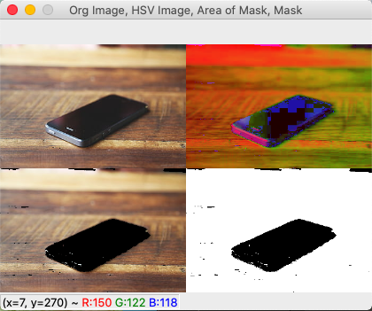
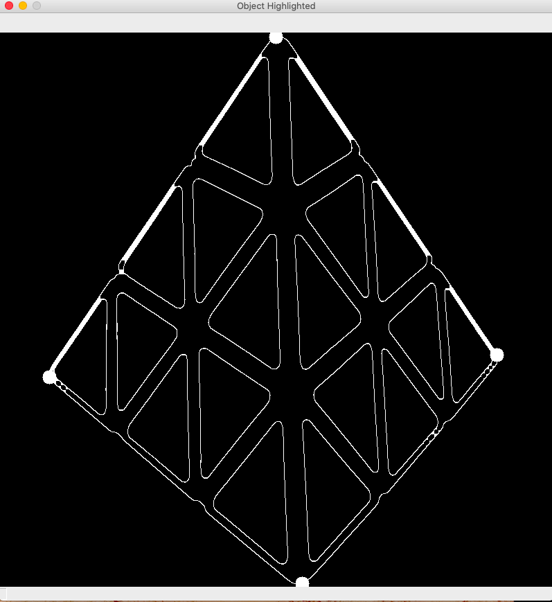
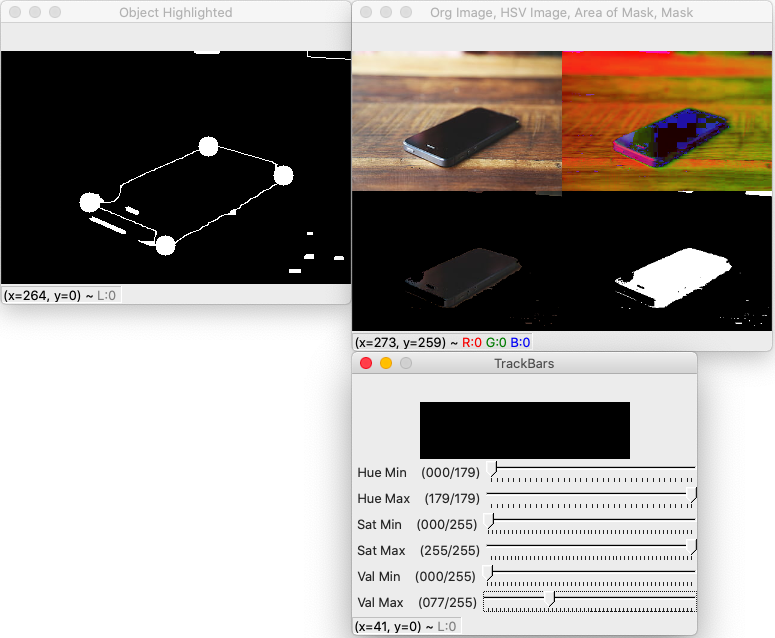
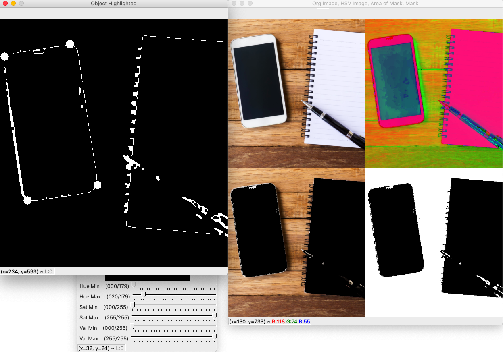
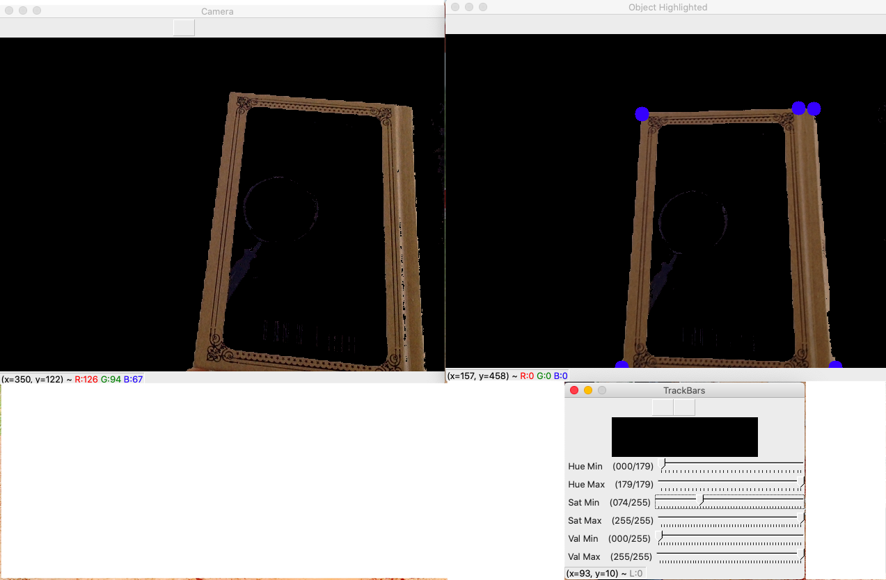
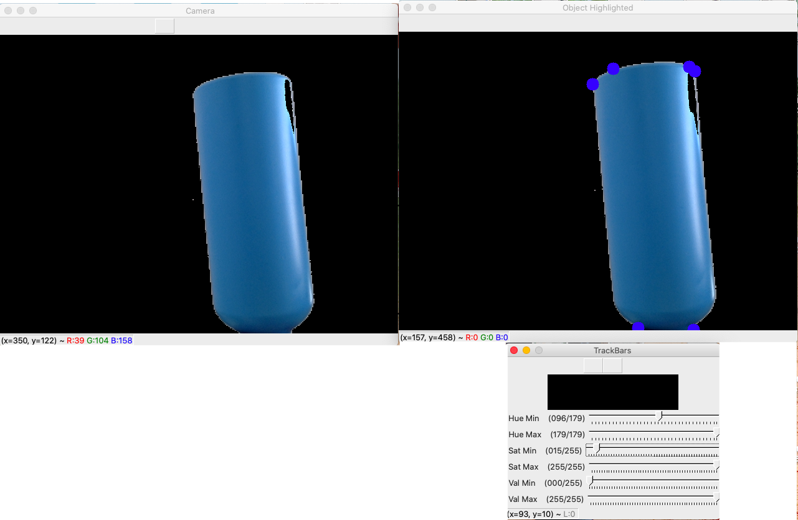
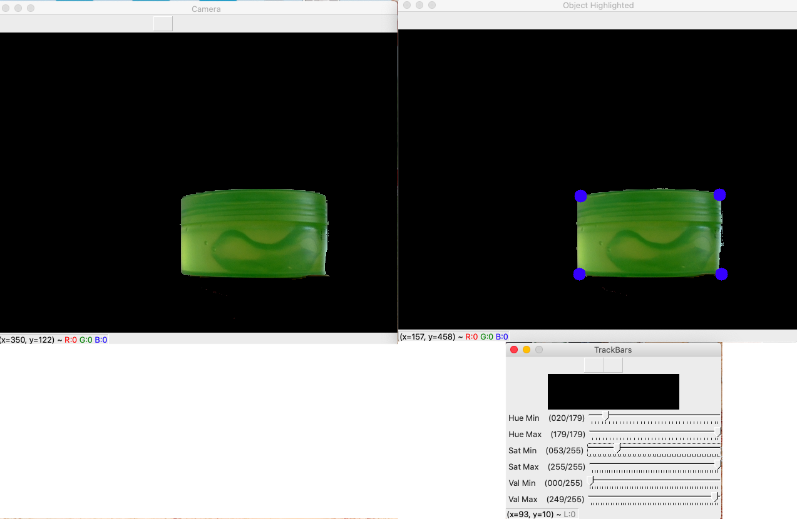
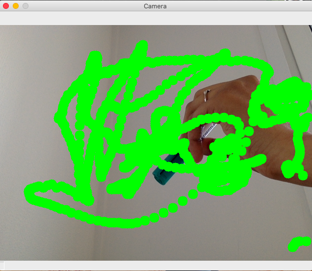

# OpenCV
Computer Vision Repository

I will try different openCV functions used for Image processing.

**1_making_Mask.py:** 
- By adjusting Hue and Saturation level of the Image, we can obatain masks of simple images. Download the file, change the input image path in line 42 and run!
- *Functions used:* cv2.createTrackbar, cv2.getTrackbarPos, cv2.inRange, cv2.bitwise_and, np.hstack, cv2.resize, cv2.cvtColor, cv2.namedWindow, cv2.resizeWindow

**2_small_object_detection.py:**
- By finding and drawing contours in the Image, we can obtain the position of the object. Download the file, change the input image path in line 4 and run!
- *Functions used:* cv2.findContours, cv2.contourArea, cv2.drawContours, cv2.cv2.arcLength, cv2.Canny, cv2.approxPolyDP, cv2.GaussianBlur, cv2.dilate, cv2.erode, cv2.cvtColor

    
**3_mask_and_detection.py:**
- By adjusting Hue and Saturation level of the Image, we can make the desired contours more prominent. Now you can make the mask of desired object in the image. Download the file, change the input image path in line 60 and run!
- *Functions used:* , cv2.createTrackbar, cv2.getTrackbarPos, cv2.inRange, cv2.bitwise_and, np.hstack, cv2.resize, cv2.cvtColor, cv2.namedWindow, cv2.resizeWindow, cv2.findContours, cv2.erode, cv2.contourArea, cv2.drawContours, cv2.cv2.arcLength, cv2.Canny, cv2.approxPolyDP, cv2.GaussianBlur, cv2.dilate

**4_object_detection_on_camera.py:**
- By adjusting Hue and Saturation level of the screen you can focus on detecting the desired object. Change the camera from primary to other if required in line 5 and run!

**5_finding_marker_and_writing_live.py:**
- Initially set the desired Hue and Saturation values to focus only on the marker cap and start writing. Change values according to your camera settings in line 10 and change color of ink in line 11 and run!

